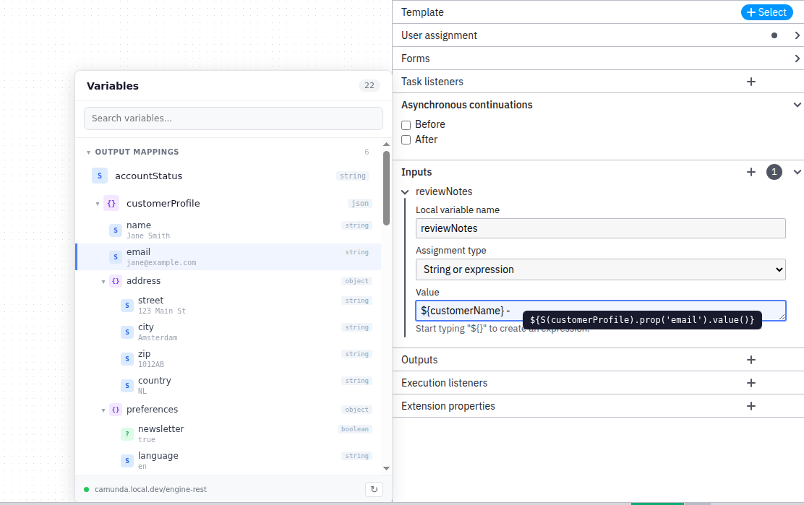

# Camunda Variable Picker

A drag-and-drop variable picker plugin for [Camunda Modeler](https://github.com/camunda/camunda-modeler) targeting **Camunda 7**.

Browse process variables in a floating panel and drag them into expression fields. JSON variables expand into a navigable tree with automatic SPIN expression generation.



## Features

- **Variable scanning** — extracts variables from I/O mappings, form fields, result variables, and script tasks
- **Upstream filtering** — only shows variables available at the selected element's position in the process
- **JSON tree** — JSON-typed variables expand into a collapsible tree; dragging a nested property generates the correct SPIN expression (e.g., `S(order).prop('customer').prop('name').value()`)
- **Context-aware insertion** — inserts `${expression}` or just the expression depending on cursor context
- **Camunda 7 REST API** — fetches runtime variables from the engine using the existing deployment configuration (endpoint URL + auth)
- **Search** — filter variables by name, JSON keys, or values
- **Drag & drop** — drag variables from the panel into any expression field in the properties panel

## Installation

1. Clone or download this repository into your Camunda Modeler plugins directory:
   ```
   ~/.config/camunda-modeler/plugins/variable-picker
   ```

2. Install dependencies and build:
   ```bash
   npm install
   npm run build
   ```

3. Restart Camunda Modeler.

## Development

```bash
npm install
npm run watch   # rebuild on changes
```

## License

[MIT](LICENSE)
